# Relatório Final de Projeto P2 - Ciência de Dados em Saúde

# Projeto de Predição de Prognóstico de Mortalidade com Dados Sintéticos

# 1. Apresentação

O presente projeto foi originado no contexto das atividades da disciplina de pós-graduação [*Ciência e Visualização de Dados em Saúde*](https://ds4h.org), oferecida no primeiro semestre de 2022, na Unicamp e elaborado pelos seguintes alunos:

| Nome                          | RA     | Especialização |
| ----------------------------- | ------ | -------------- |
| Bruna Osti                    | 231024 | Computação     |
| Fabio Fogliarini Brolesi      | 023718 | Computação     |
| Ingrid Alves de Paiva Barbosa | 182849 | Computação     |

Tabela 1 - Eqipe autora do projeto.

# 2. Contextualização da Proposta

## 2.1. Estudo de prognósticos

A área de pesquisa de prognósticos busca entender e melhorar os resultados de prognósticos em pessoas com uma determinada doença ou condição de saúde. O objetivo geral de estudos prognósticos em contextos clínicos é ajudar clínicos, pacientes e familiares a tomar decisões esclarecidas a respeito de cuidados de saúde com base em informações disponíveis sobre cada paciente no presente para prever desfechos no futuro [1]. Além disso, ajuda os pacientes e os familiares a tomar decisões adequadas a respeito do fim da vida daqueles cujo risco de morte é muito alto e a identificar intervenções personalizadas para evitar futuras hospitalizações [2].

Os modelos prognósticos usam vários fatores em combinação para prever o risco de resultados clínicos futuros em pacientes. Um bom modelo deve (i) fornecer previsões precisas que informam os pacientes e seus cuidadores, (ii) apoiar a pesquisa clínica e (iii) permitir decisões para melhorar os resultados dos tratamentos aos pacientes [1]. Um modelo prognóstico tem três fases principais: desenvolvimento do modelo (incluindo validação interna), validação externa e investigações de impacto na prática clínica. Embora muitos modelos prognósticos sejam propostos, poucos são atualmente usados na prática clínica [1].

Entre os prognósticos existentes, alguns são apresentados abaixo:

* _Simplified Acute Physiology Score III_ (SAPS3): Considera a idade, se já vêm de pré-hospitalização, qual a localização anterior (urgência, UCI e outros), se possui alguma comorbidade, qual o motivo da entrada, e variáveis medidas no momento do atendimento, para gerar a mortalidade prevista [3]. 
* _Palliative Prognostic Index_ (PPI): Prediz a mortalidade em pacientes terminais com base em cinco critérios, sendo eles a escala de desempenho paliativo, a ingestão oral, presença de edemas, se há dispneia em repouso ou se há delírios. Com base nestes parâmetros, é informado em até quantas semanas é esperado que este paciente venha à óbito [4].
* _Palliative Prognostic Score_ (PaP): Semelhante ao anterior, também foca em pacientes em cuidados paliativos. Neste caso os parâmetros de entrada são Dispneia, Anorexia, Karnofsky Performance Status, Previsão Clínica de Sobrevivência (semanas), Total de WBC e Linfócitos %, para predizer a probabilidade de sobrevivência em 30 dias [5]. 
* _MAGGIC Risk Calculator for Heart Failure_ (MAGGIC RCHF): Este prognóstico foca apenas em pessoas que sofrem da condição de insuficiência cardíaca, e com base nos parâmetros de entrada, estima a mortalidade em 1 e 3 anos [6].

## 2.2. Proposta de projeto

A proposta deste projeto é montar um ou mais modelos de prognóstico que realizem a predição de mortalidade de pacientes sintéticos gerados em pelo menos dois cenários de dados fictícios. Será necessário estabelecer os parâmetros de predição, definir quais os dados sobre o paciente que serão usados para a predição, construir modelos de aprendizagem de máquina que realizem predições e apresentar o resultado do modelo de predição aplicado.

Ao analisar os prognósticos apresentados na seção 2.1, percebeu-se que a maioria deles foca em um determinado cenário, e que há entradas e saídas muito bem definidas e apresentadas de forma clara para que o médico e a família possam interpretar. Diante deste cenário, a pergunta de pesquisa levantada então para este projeto é a seguinte:

> Com dados de eventos e condições de pacientes a partir dos seus registros disponíveis, é possível predizer o prognóstico de evolução para óbito de pacientes dentro de 7 dias e 15 dias?

## 2.3. Ferramentas

Para o presente trabalho, utilizou-se as seguintes ferramentas:

* Tecnologia _Python_, para desenvolver as provas de conceito;
* Bibliotecas _Panda, Glob, OS, Matplotlib.pyplot, Seaborn e Datetime_ como suporte para as funções necessárias;
* _Notebook Jupyter_, para escrita dos códigos em ambiente de execução;
* _Orange Data Mining_, para treinar e testar o sistema, além de gerar as saídas;
* _Scripts Shell_, para execução de fluxo de dados (_data pipeline_);
* Base de dados _Synthea_, para geração do modelo de prognóstico e também para testes.

## 2.4. Organização do repositório

O trabalho desenvolvido é divulgado de forma pública em [*repositório do GitHub*](https://github.com/brolesi/ds4h) e sua organização foi feita da seguinte forma:

~~~
├── README.md                         <- relatório do projeto (você está aqui!)
│
├── data
│   ├── interim                        <- dados intermediários usados para gerar os dados de saída
|     ├── results7_1_1.csv             <- resultado treinado no cenário 1 e testado no cenário 1 para 7 dias
|     ├── results7_2_2.csv             <- resultado treinado no cenário 2 e testado no cenário 2 para 7 dias
|     ├── results15_1_1.csv            <- resultado treinado no cenário 1 e testado no cenário 1 para 15 dias
|     └── results15_2_2.csv            <- resultado treinado no cenário 2 e testado no cenário 2 para 15 dias
│   ├── processed                      <- dados finais usados para a modelagem
|     ├── (...)15days_scenario1.csv    <- resultado do notebook "Dataset Generator" para 15 dias no cenário 1
|     ├── (...)15days_scenario2.csv    <- resultado do notebook "Dataset Generator" para 15 dias no cenário 2
|     ├── (...)7days_scenario1.csv     <- resultado do notebook "Dataset Generator" para 7 dias no cenário 1
|     └── (...)7days_scenario2.csv     <- resultado do notebook "Dataset Generator" para 7 dias no cenário 2
│   ├── output                         <- dados de saída que podem ser usados pelos médicos
|     ├── output_1_1.csv               <- resultado do notebook "output_generator" para treino no cenário 1 e teste no cenário 1
|     └── output_2_2.csv               <- resultado do notebook "output_generator" para treino no cenário 2 e teste no cenário 2
│   └── raw                            <- dados originais sem modificações copiados da base do Synthea.
│
├── notebooks                          <- Jupyter notebooks gerados  
│   ├── Dataset Generator.ipynb        <- Notebook que gera dos arquivos que serão usados de entrada no Orange
|   └── output_generator.ipynb         <- Notebook que gera os arquivos de saída com o prognóstico, com base na saída do Orange
├── src                                <- workflows desenvolvidos no Orange
|   ├── cenarios-07-dias.ows           <- Workflow para prognóstico de óbito em 7 dias
|   ├── cenarios-15-dias.ows           <- Workflow para prognóstico de óbito em 15 dias
│   └── README.md                      <- instruções básicas de execução
│
└── assets                             <- mídias usadas no projeto
~~~

# 3. Metodologia

## 3.1 Entendimento dos dados

Para realizar o prognóstico, há o desafio de identificar quais serão seus dados de entrada e seus dados de saída. Além disso, também há o desafio de escolher como estes dados de entrada serão processados para gerar os dados de saída.

Neste trabalho, optou-se pela tecnologia _Machine Learning_, que usa de fórmulas e métodos para ensinar a máquina de acordo com um alvo, assim, ela sabe como agir em determinadas situações [7]. Neste trabalho, com base em dados já existentes, será ensinado a uma máquina quais os parâmetros que influenciaram mais ou menos na evolução de uma pessoa à òbito, para que ela aprenda e diga qual a probabilidade de que uma determinada pessoa viva, com determinadas características, venha a óbito em 7 dias ou em 15 dias.

Foram usados dados dos cenários sintéticos do [Synthea](https://synthea.mitre.org/) presentes no repositório [Github](https://github.com/santanche/lab2learn/tree/master/data/synthea). As bases utilizadas para o presente projeto são as que seguem:

* [scenario01](/data/raw/scenario01/)
* [scenario02](/data/raw/scenario02/)

O _Synthea_ tem a missão de produzir dados de pacientes sintéticos e realistas, mas não reais, de alta qualidade e registros de saúde associados, cobrindo todos os aspectos da saúde. Os dados resultantes estão livres de restrições de custo, privacidade e segurança. Ele pode ser usado sem restrições para uma variedade de usos secundários na academia, pesquisa, indústria e governo. Cada paciente sintético do _Synthea_ é gerado de forma independente, à medida que progride desde o nascimento até a morte por meio de representações modulares de várias doenças e condições. Cada paciente percorre todos os módulos do sistema. Quando um paciente morre ou a simulação chega ao dia atual, esse registro do paciente pode ser exportado em vários formatos diferentes [8]. A figura 1 apresenta uma sinteze da organização dos dados do _Synthea_.

Figura 1 - organização dos dados do Synthea [8].

Na base de dados do _Synthea_, os dados estão presentes em arquivos CSV (*comma separeted values*) e são os que seguem, conforme a Tabela 2 [9]:

| Arquivo                   | Descrição                                                                     |
| ------------------------- | ----------------------------------------------------------------------------- |
| `allergies.csv`           | Dados de alergia do paciente.                                                 |
| `careplans.csv`           | Dados do plano de atendimento ao paciente.                                    |
| `claims.csv`              | Dados de solicitações do paciente.                                            |
| `claims_transactions.csv` | Transações por item de linha por solicitação.                                 |
| `conditions.csv`          | Condições ou diagnósticos do paciente.                                        |
| `devices.csv`             | Dispositivos permanentes e semipermanentes utilizados pelo paciente.          |
| `encounters.csv`          | Dados de encontro do paciente.                                                |
| `imaging_studies.csv`     | Metadados de imagem do paciente.                                              |
| `immunizations.csv`       | Dados de imunização do paciente.                                              |
| `medications.csv`         | Dados de medicação do paciente.                                               |
| `observations.csv`        | Observações do paciente, incluindo sinais vitais e relatórios de laboratório. |
| `organizations.csv`       | Organizações fornecedoras, incluindo hospitais.                               |
| `patients.csv`            | Dados demográficos do paciente.                                               |
| `payer_transitions.csv`   | Dados de transição do pagador (ou seja, alterações no seguro de saúde).       |
| `payers.csv`              | Dados do plano de saúde.                                                      |
| `procedures.csv`          | Dados do procedimento do paciente, incluindo cirurgias.                       |
| `providers.csv`           | Médicos que prestam assistência ao paciente.                                  |
| `supplies.csv`            | Materiais utilizados na prestação de cuidados.                                |

Tabela 2: arquivos disponíveis no repositório e descrição de cada um [9].

Utilizou-se as tabelas `patients`, `encounters` e `conditions` para fazer uma análise exploratória dos dados. Posteriormente, utilizou-se as tabela `patients` e `encounters` para cálculo da probabilidade de óbito em até 7 dias e em até 15 dias.

Estas três tabelas são as mais relevantes de toda a base, e a integração dos dados pode ser melhor compreendida a partir da estrutura apresentada na Figura 2. 

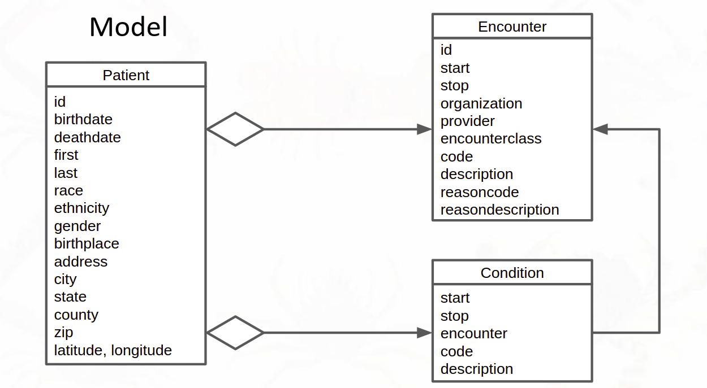

Figura 2 - Integração das tabelas `patients` e `encounters`.

## 3.2 Análise descritiva

Como já citado, primeiramente foram realizadas algumas análises dos dados das tabelas `patients`, `encounters` e `conditions` para entender quais condições mais levavam os pacientes á óbitos, e tomar as decisões para escolha de cenário de aplicação do prognóstico.

No cenário 1, foram encontrados 1174 pacientes diferentes, sendo que 174 deles já haviam ido à òbito, enquanto no cenário 2 haviam 1121 pacientes, com 121 óbitos. Em ambos os cenários haviam 1000 pacientes ainda em vida. 

Foi análisado a idade com que os pacientes foram à òbito, e a estratificação por gênero é apresentada na Figura 3, na qual é possível analisar que os homens morreram em idades mais avançadas que as mulheres, em ambos os cenários. 

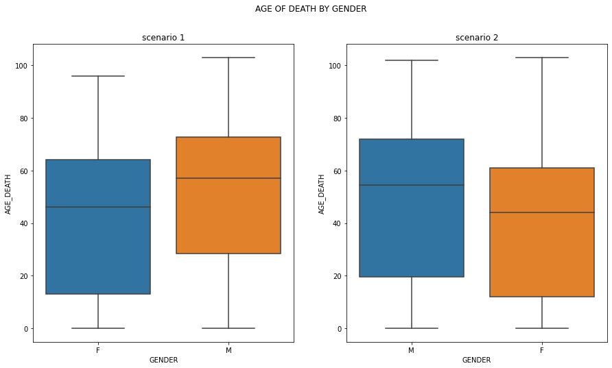

Figura 3 - Idade de falecimento por gênero em cada cenário.

Foi analisada ainda as condições que mais levaram a óbito considerando o prazo de até 7 dias. É possível perceber na Figura 4 que a maior causa de morte no cenário 1 é a Leucemia mielóide aguda (*Acute myeloid leukemia* - 91861009) e no cenário 2 é a Hiperlipidemia (*Hyperlipidemia* - 55822004). 

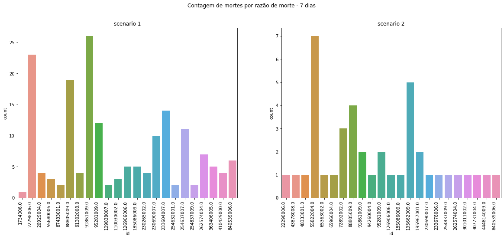

Figura 4 - maiores causas de morte por cenário.

Entretanto, percebeu-se que nem todas as condições que levaram a òbito no cenário 1 estavam presentes no cenário 2. Isso poderia atrapalhar no modelo que seria gerado posteriormente. Por essa razão, foi analisado quais eram as causas de morte presente em ambos os cenários, conforme apresentado na Figura 5.

Figura 5 - Maiores causas de morte em comum nos dois cenários.

É possível perceber que a condição que mais levou à óbito, somando os dois cenários, é a Insuficiência cardíaca congestiva crônica (*Chronic congestive heart failure* - 88805009).

## 3.3 Modelo

Para compreensão do modelo de forma mais simples, ele será dividido em 3 fases, sendo:

* Fase 1 - Preparação dos dados de entrada
* Fase 2 - Treino e teste do sistema
* Fase 3 - Extração dos resultados para geração dos dados de saída

### 3.3.1 Fase 1 - Preparação dos dados de entrada

Para gerar os dados que seriam aplicados no modelo, foi desenvolvido o _notebook_ ["Dataset generator"](notebooks/Dataset Generator.ipynb). Com a estruturação dos dados a partir do cruzamento entre eles, realizou-se a criação de colunas (características, ou, em inglês na área de ciência de dados, *feature*) sintéticas a partir de colunas originas de de dados categóricos para, a partir do aumento da dimensionalidade, trazer maior riquza para a criação do modelo considerando aspectos relevantes para a análise.

Ao final, as colunas relevantes para o desenvolvimento do _datamart_ foram as presentes na Tabela 3:

| **Tabela origem** | **Campo**                 | **Coluna origem**   | **Descrição**                                                                               |
| ----------------- | ------------------------- | ------------------- | ------------------------------------------------------------------------------------------- |
| ENCOUNTERS        | TOTAL_CLAIM_COST          | TOTAL_CLAIM_COST    | Custo total do encontro                                                                     |
| ENCOUNTERS        | ENCOUNTERCLASS_wellness   | ENCOUNTERCLASS      | Classe de encontro marcada como rotineira                                                   |
| ENCOUNTERS        | ENCOUNTERCLASS_urgentcare | ENCOUNTERCLASS      | Classe de encontro marcada como de urgência                                                 |
| ENCOUNTERS        | ENCOUNTERCLASS_snf        | ENCOUNTERCLASS      | Classe de encontro marcada como centro de enfermagem especializada                          |
| ENCOUNTERS        | ENCOUNTERCLASS_outpatient | ENCOUNTERCLASS      | Classe de encontro marcada como ambulatorial                                                |
| ENCOUNTERS        | ENCOUNTERCLASS_inpatient  | ENCOUNTERCLASS      | Classe de encontro marcada como internação                                                  |
| ENCOUNTERS        | ENCOUNTERCLASS_home       | ENCOUNTERCLASS      | Classe de encontro marcada como domiciliar                                                  |
| ENCOUNTERS        | ENCOUNTERCLASS_emergency  | ENCOUNTERCLASS      | Classe de encontro marcada como emergência                                                  |
| ENCOUNTERS        | ENCOUNTERCLASS_ambulatory | ENCOUNTERCLASS      | Classe de encontro marcada como ambulatorial                                                |
| ENCOUNTERS        | PAYER_COVERAGE            | PAYER_COVERAGE      | Valor do custo coberto pelo Pagador                                                         |
| PATIENTS          | BIRTHDATE                 | BIRTHDATE           | Data em que o paciente nasceu.                                                              |
| PATIENTS          | MARITAL                   | MARITAL             | Estado civil. M é casado, S é solteiro, divórciado (D) ou viuvo (W)                         |
| PATIENTS          | HEALTHCARE_COVERAGE       | HEALTHCARE_COVERAGE | Custo total ao longo da vida dos serviços de saúde que foram cobertos pela seguradora       |
| PATIENTS          | HEALTHCARE_EXPENSES       | HEALTHCARE_EXPENSES | Custo total ao longo da vida dos cuidados de saúde que o paciente pagou                     |
| PATIENTS          | LON                       | LON                 | Longitude do endereço do paciente                                                           |
| PATIENTS          | LAT                       | LAT                 | Latitude do endereço do paciente                                                            |
| PATIENTS          | ZIP                       | ZIP                 | Código postal do paciente                                                                   |
| PATIENTS          | GENDER                    | GENDER              | Gênero. M é masculino, F é feminino.                                                        |
| PATIENTS          | ETHNICITY                 | ETHNICITY           | Descrição da etnia primária do paciente                                                     |
| PATIENTS          | RACE                      | RACE                | Descrição da raça primária do paciente                                                      |
| ENCOUNTERS        | BASE_ENCOUNTER_COST       | BASE_ENCOUNTER_COST | Custo do encontro, sem incluir medicamentos, imunizações, procedimentos ou outros serviços. |

Tabela 3: Campos utilizados para composição do *datamart* a ser considerado para a geração do modelo de aprendizado de máquina. A **coluna origem** indica que o campo foi criado artificialmente de uma *feature* categórica da tabela origem.

Ainda neste arquivo gerado, foi adicionado um parâmetro chamado de _death_threshould_ que possui valor **_True_** quando o paciente foi a óbito em 7 dias ou em 15 dias e **_False_** em caso contrário. Esse parâmetro será o alvo posteriormente no modelo. 

Os 04 arquivos preparados, para 7 dias e 15 dias em ambos os cenários, podem ser vistos [no repositório](https://github.com/brolesi/ds4h/tree/main/data/processed).

Para o modelo, primeiro foi necessário eliminar todos os dados que poderiam causar bias, restando os parâmetros já apresentados na seção 3.3. Em seguida, os pacientes de cada cenário foram divididos em dois grupos, sendo um daqueles que já haviam ido à òbito e o outro daqueles que ainda estavam em vida. A proposta inicial seria de utilizar os dados do grupo dos pacientes que já foram a obito para treinar o sistema e os dados do grupo dos pacientes que estão em vida para prognóstico. Entretanto, o número de pacientes que já foram a obito com a condição pré-definida não possuía o tamanho suficiente para treinar o sistema. Por essa razão, foram usados os dados dos pacientes em vida como contraponto no treinamento.

Utilizou-se a técnica de *Support Vector Machines* afim de identificar a segregação a partir de hiperplanos dos dados em dois: prognóstico de evolução à óbito em até $7$ dias (ou em até $7$ dias) e prognóstico de evolução à óbito igual ou superior a $7$ dias (ou superior a $15$ dias). Dado que a quantidade de registros era pequena, o resultado não foi como o esperado, por isso, utilizou-se da técnica de *data augmentation* (ou, aumento de dados, a partir da criação de dados sintéticos, baseados nos dados originais), para que as amostras ficassem balanceadas.

### 3.3.2 Fase 2 - Treino e teste do sistema

É o núcleo do modelo em si foi feito em dois _Workflows_ do _Orange Data Mining_, sendo um para óbito em até 7 dias e outro para óbito em até 15 dias. Ambos seguem o mesmo padrão e conceitos.

Para cada _workflow_ foram construidas 4 estruturas diferentes, para comparação dos resultados:

* Treino com o cenário 1 e teste com o cenário 1:
 
 

Figura 6 - Configuração do treino com o cenário 1 e teste com o cenário 1.
 
* Treino com o cenário 2 e teste com o cenário 2:

Figura 7- Configuração do treino com o cenário 2 e teste com o cenário 2.

* Treino com o cenário 1 e teste com o cenário 2:

Figura 8- Configuração do treino com o cenário 1 e teste com o cenário 2.

* Treino com o cenário 2 e teste com o cenário 1:

Figura 9 - Configuração do treino com o cenário 2 e teste com o cenário 1.

Já para o _pipeline_ de dados foram usados 3 modelos, a saber:

#### A. Regressão logística

O modelo de regressão logística tem como objetivo estudar a probabilidade de ocorrência de eventos, aqui chamado de $Y$, apresentado na forma qualitativa dicotômica (aqui usados no caos os valores $0$ para um não-evento e $1$ para um evento). Para isso, foi definido um vetor de variáveis explicativas, com seus respectivos parâmetros estimados, na forma [10]:

$$Z_i = \alpha + \beta_1X_{1i} +  \beta_2X_{2i} + \cdots + \beta_kX_{ki}  $$ 

em que, $Z$ é o *logito*, $\alpha$ representa a constante (bias), $\beta_j$ são os parâmetros estimados de cada variável explicativa, $X_j$ são as variáveis explicativas (métricas ou *dummies*) e $i$ é a i-ésima observação da amostra [10].

É importante destacar que Z não é variável dependente, já que é definida por $Y$. O objetivo é definir a expressão da **probabilidade de óbito em 7 ou 15 dias** $p_i$ de ocorrência, em função do logito $Z_i$, ou seja, em função dos parâmetros estimados para cada variável explicativa. Para tanto, devemos definir o conceito de **chance** de ocorrência de um evento, também conhecida por *odds*, da seguinte forma [10]: 

$$chance(odds)_{Y_i=1} = \frac{p_i}{1-p_i}$$ 

A regressão logística binária define o logito $Z$ como o logaritmo natural da chance, de modo que:

$$ ln(chance_{Y_i=1}) = Z_i$$ 

De onde tem-se:

$$ ln\left(\frac{p_i}{1-p_i}\right) = Z_i $$ [10]

Na medida em que é necessário identificar uma expressão para a probabilidade de **ocorrência do evento**  em função do logito, pode-se matematicamente isolar $p_i$ da seguinte maneira:

$$ \frac{p_i}{1-p_i} = e^{Z_i} $$ 

logo

$$ p_i =(1-p_i)e^{Z_i}$$ 

então

$$ p_i(1+e^{Z_i})=e^{Z_i} $$

Disso então tem-se finalmente que:

**Chance de ocorrência do evento:**

$$ p_i = \frac{e^{Z_i}}{1+e^{Z_i}} = \frac{1}{1+e^{-Z_i}}$$

**Chance de ocorrência de um não evento:**

$$ 1 - p_i = 1 - \frac{e^{Z_i}}{1+e^{Z_i}} = \frac{1}{1+e^{Z_i}}$$ 

No workflow, a regressão logística foi configurada conforme apresentado na Figura 10.

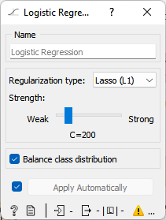

Figura 10 - Configuração da regressão logística.

#### B. Árvore de decisão

O segundo método usado foi a árvore de decisão, onde na primeira divisão ou raiz, todas as features são consideradas e os dados de treinamento são divididos em grupos com base nessa divisão. Serão feitas $n$ divisões, tais quais forem as variedades da _feature_ candidata. Para calcular quanta precisão cada divisão custará, usando uma função custo. A divisão que custa menos é escolhida. Este algoritmo é recursivo por natureza, pois os grupos formados podem ser subdivididos usando a mesma estratégia. Devido a este procedimento, este algoritmo também é conhecido como algoritmo guloso (*greedy*). Isso torna o nó raiz o melhor preditor/classificador [11].

Ao olhar para o custo de uma divisão, é necessário olhar as funções de custo usadas para classificação e regressão. Em ambos os casos as funções de custo tentam encontrar ramos mais homogêneos, ou ramos com grupos com respostas semelhantes. Isso dá mais certeza de que uma entrada de dados de teste seguirá um determinado caminho [11].

Há ainda a chamada pontuação Gini, conforme equação a seguir:

$$ G = \sum(pk * (1 — pk)) $$

Uma pontuação Gini dá uma ideia de quão boa é uma divisão pelo quão mistas são as classes de resposta nos grupos criados pela divisão. Aqui, $pk$ é a proporção de entradas da mesma classe presentes em um determinado grupo. Uma pureza de classe perfeita ocorre quando um grupo contém todas as entradas da mesma classe, caso em que $pk$ é $1$ ou $0$ e $G = 0$, onde um nó com uma divisão de $50-50$ classes em um grupo tem a pior pureza, então para uma classificação binária terá $pk = 0,5$ e $G = 0,5$ [11].

Como um problema geralmente possui um grande conjunto de _features_, ele resulta em grande número de divisões, o que por sua vez resulta em uma árvore grande. Essas árvores são complexas e podem levar a _overfitting_, então, é necessário saber quando parar. Uma maneira de fazer isso é definir um número mínimo de entradas de treinamento para usar em cada folha. Outra maneira é definir a profundidade máxima do seu modelo. A profundidade máxima refere-se ao comprimento do caminho mais longo de uma raiz a uma folha [11]. 

O desempenho de uma árvore pode ser aumentado ainda mais pela poda. Trata-se de remover as ramificações que fazem uso de recursos de baixa relevância. Dessa forma, se reduz a complexidade da árvore e, assim, aumenta-se seu poder preditivo, reduzindo o _overfitting_ [11].

Entre as vantagens da árvore de decisão estão [11]:

* É simples de entender, interpretar, visualizar.
* As árvores de decisão executam implicitamente a triagem de variáveis ou a seleção de recursos.
* Pode lidar com dados numéricos e categóricos. Também pode lidar com problemas de várias saídas.
* As árvores de decisão exigem relativamente pouco esforço dos usuários para a preparação dos dados.
* As relações não lineares entre os parâmetros não afetam o desempenho da árvore.

Mas também há desvantagens [11]:

* Os aprendizes de árvores de decisão podem criar árvores supercomplexas que não generalizam bem os dados. Isso é chamado de sobreajuste.
* As árvores de decisão podem ser instáveis porque pequenas variações nos dados podem resultar na geração de uma árvore completamente diferente. Isso é chamado de variação , que precisa ser reduzido por métodos como ensacamento e aumento.
* Algoritmos gananciosos não podem garantir o retorno da árvore de decisão globalmente ótima. Isso pode ser mitigado treinando várias árvores, onde os recursos e as amostras são amostrados aleatoriamente com substituição.
* Os aprendizes de árvores de decisão criam árvores tendenciosas se algumas classes dominarem . Portanto, é recomendado balancear o conjunto de dados antes de ajustar com a árvore de decisão.

No workflow, a árvore de decisão foi configurada conforme apresentado na Figura 11.

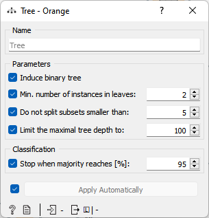

Figura 11 - Configuração da árvore de decisão.

#### C. _Gradient boosting_ (mais especificamente XGBoosting)

XGBoost significa "Extreme Gradient Boosting", onde o termo "Gradient Boosting" tem origem no artigo **Greedy Function Approximation: A Gradient Boosting Machine**, de Friedman [12].

As árvores impulsionadas por gradiente já existem há algum tempo. O XGBoost é usado para problemas de aprendizado supervisionado, onde usamos os dados de treinamento (com várias *features*) para prever uma variável resposta. O modelo de conjunto de árvores consiste em um conjunto de árvores de classificação e regressão (*classification and regression trees* ou CART). Um CART é um pouco diferente das árvores de decisão, nas quais a folha contém apenas valores de decisão. No CART, uma pontuação real é associada a cada uma das folhas, o que nos dá interpretações mais ricas que vão além da classificação. Isso também permite uma abordagem unificada e baseada em princípios para otimização [13].

Normalmente, uma única árvore não é forte o suficiente para ser usada na prática. O que é realmente usado é o modelo ensemble, que soma a previsão de várias árvores juntas. As pontuações de previsão de cada árvore individual são somadas para obter a pontuação final. Se você observar o exemplo, um fato importante é que as duas árvores tentam se complementar [13]. Matematicamente, podemos escrever nosso modelo na forma:

$$ \hat{y}_i = \sum_{k=1}^K f_k(x_i), f_k \in \mathcal{F} $$ 

Onde $K$ é o número de árvores,$f_k$ é uma função no espaço funcional $\mathcal{F}$, e $\mathcal{F}$ é o conjunto de todos os CARTs possíveis. 
A função objetivo a ser otimizada é dada por:

 $$ \text{obj}(\theta) = \sum_i^nl(y_i, \hat{y}_i) + \sum_{k=1}^K \omega(f_k) $$

Onde $\omega(f_k)$ é a complexidade da árvore $f_k$.

Florestas aleatórias e árvores impulsionadas são realmente os mesmos modelos, a diferença surge de como eles são treinados.

No workflow, o XGBoosting foi configurado conforme apresentado na Figura 12.

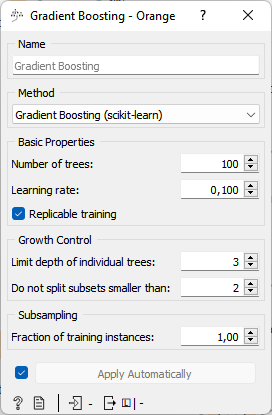

Figura 12 - Configuração do XGBoosting.

#### 3.3.3 Fase 3 - Extração dos resultados para geração dos dados de saída

Ao final da execução do _workflow_ é gerado um arquivo de saída com as probabilidades de óbito em 7 dias e em 15 dias para cada modelo gerado. Este arquivo não é entendivel por uma pessoa leiga, por essa razão precisa ser tratado. O _notebook_ ["output_generator"](https://github.com/brolesi/ds4h/blob/main/notebooks/output_generator.ipynb) foi desenvolvido para esta finalidade. Poderiam ser mantidos todos os modelos e também todas as 4 formas de treino/teste apresentadas, mas elas gerariam muitas saídas diferentes, então foram geradas apenas duas para exemplo e comparação. Foi feito um arquivo de saída para treino e teste no cenário 1 e um arquivo de saída para treino e teste no cenário 2. Este arquivo de saída é do tipo .csv possui apenas 3 colunas, sendo elas, o Id do paciente, sua probabilidade de ir à óbito em 7 dias e sua probabilidade de ir à obito em 15 dias.

# 4. Resultados e Discussão

Para compreender os resultados dos modelos, foram gerados a curva ROC, a matriz de confusão e a tabela de Scores, com AUC, CA, F1, _Precision_ e _Recall_. Como são 04 tipos de treino e teste, para 2 cenários diferentes (07 dias e 15 dias), o volume de figuras para trazer ao relatório seria muito alto, por isso, aqui serão apresentados apenas um de cada, e os resultados completos podem ser vistos no relatórios gerados pelo _Orange_: [Relatório 7 dias](https://github.com/brolesi/ds4h/blob/main/assets/report-7-days-roc.pdf) e [Relatório 15 dias](https://github.com/brolesi/ds4h/blob/main/assets/report-15-days-roc.pdf)

* Curva ROC:

Figura 13 - Curva ROC para 7 dias com treino no cenário 1 e teste no cenário 1.

A Figura 13 apresenta a curva ROC resultante da predição de óbito de pacientes em até 7 dias, tendo sido treinado com dados do cenário 1 e testado também com o cenário 1. É possível perceber que a Regressão Logística e o XGBoosting tiveram resultados bem próximos, apesar do  XGBoosting se sobressair um pouco. Em caso de dúvidas nesta análise gráfica, pode-se consultar o valor do AUC, que é a área sobre a curva ROC. O maior valor de área possuí o melhor resultado.

* Matriz de confusão:

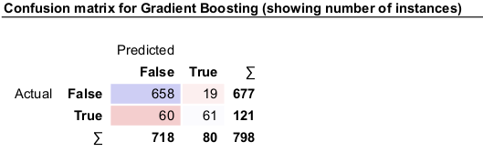

Figura 14 - Matriz de confusão para 7 dias com treino no cenário 1 e teste no cenário 1.

Ao gerar o relatório, o _Orange_ já gerou apenas a matriz de confusão com o melhor resultado entre os 3 modelos usados. Para a predição de óbito de pacientes em até 7 dias, tendo sido treinado com dados do cenário 1 e testado também com o cenário 1, o melhor resultado foi obtido com o modelo XGBoosting, em que houveram 658 verdadeiros negativos (que possuíam valor igual a **_False_** e realmente deveriam ser **_False_**), e 61 verdadeiros positivos (que possuíam valor igual a **True**  e realmente deveriam ser **_True_**). Foram encontrados 60 falsos positivos (que possuíam valor igual a **_True_** mas deveriam ser **_False_**) e apenas 19 falsos negativos (que possuíam valor igual a **_False_** mas deveriam ser **_True_**).

* Scores:

Figura 15 - Tabela de Score para 7 dias com treino no cenário 1 e teste no cenário 1.

A partir da matriz de confusão e da curva ROC é possível calcular as métricas dos modelos usados. Na Figura 15 há a área da curva ROC (AUC), a acurácia (CA), o F-score (F1), a sensibilidade (_recall_) e a precisão (_precision_) para a predição de óbito de pacientes em até 7 dias, tendo sido treinado com dados do cenário 1 e testado também com o cenário 1. É possível analisar que, apesar da AUC ser bem próxima entre a regressão logística e o XGBoosting, nas outras métricas o XGBoosting apresenta resultados melhores, principalmente do ponto de vista de precisão.

Com base nestes resultados, é possível afirmar que o XGBoosting apresentou melhores resultados em todos os parâmetros analisados para predição de óbito de pacientes em até 7 dias, tendo sido treinado com dados do cenário 1 e testado também com o cenário 1. Já para os outros cenários, não foi possível chegar a uma conclusão tão unânime assim. A tabela apresentada na Figura 16 mostra a comparação dos resultados entre os modelos, onde as células em verde-claro representam os melhores valores, as células em vermelho representam os piores valores, e as células em verde-escuro apresentam o melhor resultado geral de cada métrica entre todos os modelos e cenários.

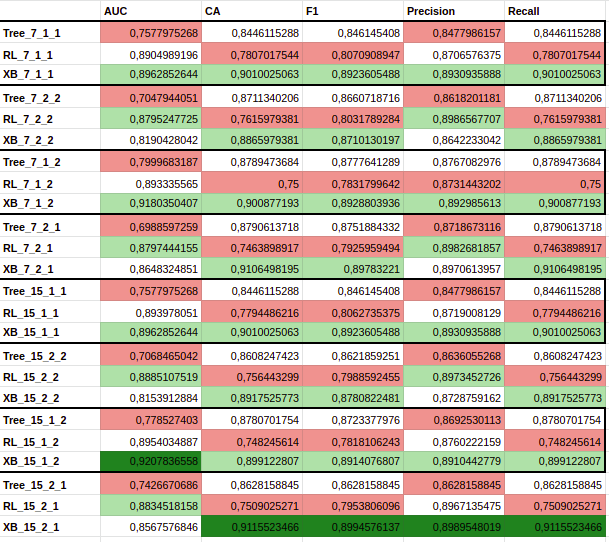

Figura 16 - Comparação dos resultados com base nos modelos.

É possível perceber que em alguns cenários, o XGBoosting apresenta os melhores resultados, já em outros a Regressão Logística se destaca. Apesar disso, ambos apresentam os piores resultados também em determinados cenários. A árvore de decisão não tem nem os melhores, nem os piores valores, ficando em uma posição intermediária. 

A tabela apresentada na Figura 17 compara os resultados entre 7 dias e 15 dias, para os mesmos modelos e formatos de treino.

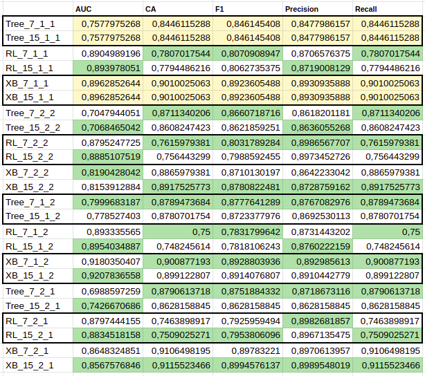

Figura 17 - Comparação dos resultados com base no número de dias para óbito.

Os cenários de prognóstico para 7 dias apresentaram os melhores valores com mais frequência, quando comparados ao prognóstico de 15 dias. É importante ressaltar também que houveram duas situações em que os resultados para 7 dias e 15 dias foram exatamente os mesmos: árvore de decisão e XGBoosting tendo sido treinados e testados no cenario 1.

Ao olhar de forma geral, o melhor resultado encontrado foi para o modelo XGBoosting para prognóstico de óbito em até 15 dias, tendo sido treinado no cenário 2 e testado no cenário 1.

Para analisar o resultado de saída que realmente irá para o médico, é apresentado na Figura 18 uma parte da base de saída gerada para treino no cenário 1 e teste no cenário 1, e na Figura 19 uma parte da base de saída gerada para treino no cenário 2 e teste no cenário 2.

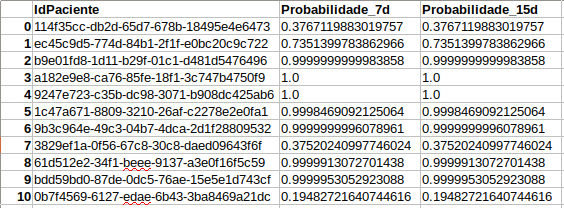

Figura 18 - Saída com treino no cenário 1 e teste no cenário 1.

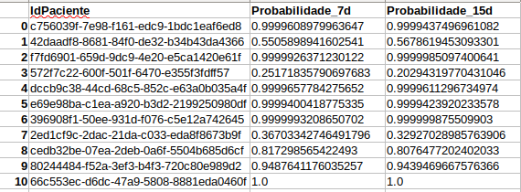

Figura 19 - Saída com treino no cenário 2 e teste no cenário 2.

É possível perceber na Figura 18 que para o treino e teste no cenário 1 os resultados da mortalidade em 7 dias e 15 dias foram exatamente os mesmos. Já na Figura 19, onde o treino e o teste foram feitos no cenário 2, houve uma diferença nos resultados da mortalidade em 7 dias e 15, porém a diferença não foi tão siginificativa.

Este ponto instigou a equipe, e ao voltar para a análise descritiva feita no início deste trabalho, percebeu-se que, no cenário 1, o número de pessoas que foram a óbito em até 15 dias é de 173 enquanto em até 7 dias é de 174, ou seja, apenas 1 pessoa a mais. Já no cenário 2, o número de pessoas que foram a óbito em até 15 dias é de 119 enquanto em até 7 dias é de 121, 2 pessoas a mais. No primeiro caso, como a diferença é de apenas 1 pessoa, esse valor não foi sufuciente para melhor predizer a mortalidade. No segundo caso, aumentando para 2 pessoas, o resultado melhora um pouco, porém ainda não é significativo. Para obter um resultado mais adequado, seria necessário ter uma base onde a diferença no número de pessoas que foram a óbito em um prazo em comparação a outro seja mais expressivo.

Apesar da base _Synthea_ ser muito útil para trabalhos e projetos da área da saúde, ela não é uma base com muitos indíviduos diferentes, e este foi o grande desafio da equipe ao trabalhar com estes dados.

# 5. Conclusão

Neste projeto, o objetivo foi predizer o prognóstico de evolução a óbito de pacientes para auxiliar os médicos e familiares a tomarem decisões futuras a respeito daquele indivíduo. Foram analisados os modelos de prognóstico já existentes hoje, e baseado nesse contexto que surge a pergunta de perquisa:

Com dados de eventos e condições de pacientes a partir dos seus registros disponíveis, é possível predizer o prognóstico de evolução para óbito de pacientes dentro de 7 dias e 15 dias?

Para esta predição, foram usados 3 modelos de machine learning: (i) árvore de decisão, (ii) regressão logística e (iii) XGBoosting, configurados para treino e teste de 4 formas diferentes: (i) treino e teste com dados do cenário 1, (ii) treino e teste com dados do cenário 2, (iii) treino com dados do cenário 1 e teste com dados do cenário 2 e (iv) treino com dados do cenário 2 e teste com dados do cenário 1. Todos os modelos e formatos de treino/teste foram desenvolvidos em dois _workflows_ do _Orange Data Mining_, sendo um para pacientes que foram a óbito em até 7 dias e outro para pacientes que foram a óbito em até 15 dias. 

Os dados de entrada para o modelo foram processados a partir da base _Synthea_, a partir de um _Notebook Jupyter_, e os dados de saída foram extraídos do _Orange_ e tratados também a partir de outro _Notebook Jupyter_, para que pudesse ser realmente utilizável pelos profissionais da saúde. 

Com base nos resultados obtidos, foi possível verificar que os melhores desempenhos ocorreram nos modelos de XGBoosting, sendo que o melhor entre eles foi para prognóstico de óbito em até 15 dias, tendo sido treinado no cenário 2 e testado no cenário 1. Além disso, não houve diferença significativa nos resultados de prognóstico para óbito em 7 dias e 15 dias, provavelmente atribuído ao inexpressivo número de pacientes acrescido de um cenário para outro. Reforça-se que o baixo número de indíviduos da base foi o grande desafio da equipe para avaliar melhor os modelos.

Apesar dos desafios apontados, com base nas métricas obtidas, foi possível responder a pergunta de pesquisa afirmando que é possível sim predizer o prognóstico de evolução para óbito de pacientes dentro de 7 dias e 15 dias. 

Existe a possibilidade de evolução do ponto de vista de utilizar/captar mais dados que possam ser relevantes para a análise e construção de um modelo mais robusto e que possa ter a capacidade de previsão mais acurada, para apoiar a definição do prognóstico médico. Outra possibilidade é a geração de mais dados sintéticos para, a partir de uma massa de dados maior, termos um modelo com maior robustez.

Por fim conclui-se que com este trabalho a equipe pôde lidar com um cenário real de análise de dados que possuí grande relevância, enfrentando desafios reais, e buscando formas de contorná-los sem afetar os resultados. Foi possível também conhecer ferramentas e metodologias novas. É importante ressaltar que estes resultados são muito críticos e um prognóstivo errado pode levar a decisões ligadas diretamente à vida de uma pessoa, e por isso, esta área precisa de aprofundamento, para alcançar resultados cada vez mais confiáveis e precisos.

# Referências Bibliográficas

[1] Patino, C.M.,  Ferreira J.C. "Prognostic studies for health care decision making". CONTINUING EDUCATION: SCIENTIFIC METHODOLOGY, J Bras Pneumol., 43 (04), Aug 2017. https://doi.org/10.1590/S1806-37562017000000241

[2] Steyerberg E.W., Moons K.G.M., van der Windt D.A., Hayden J.A., Perel P., Schroter S., et al. (2013) Prognosis Research Strategy (PROGRESS) 3: Prognostic Model Research. PLoS Med 10(2): e1001381. https://doi.org/10.1371/journal.pmed.1001381

[3] RCCC-eu (2005). Simplified Acute Physiology Score III [online]. Disponível em: https://www.rccc.eu/ppc/indicadores/saps3.html. Acessado em Maio de 2022.

[4] MDApp (2020). Palliative Prognostic Index (PPI) [online]. Disponível em: https://www.mdapp.co/palliative-prognostic-index-ppi-calculator-402/. Acessado em Maio de 2022.

[5] MDApp (2020). Palliative Prognostic Score (PaP) [online]. Disponível em: https://www.mdapp.co/palliative-prognostic-score-pap-calculator-401/. Acessado em Maio de 2022.

[6] MD+Calc (2020). MAGGIC Risk Calculator for Heart Failure [online]. Disponível em: https://www.mdcalc.com/maggic-risk-calculator-heart-failure. Acessado em Maio de 2022. 

[7] Carleo, G., Cirac, I., Cranmer, K., Daudet L., Schuld M., Tishby, N., Vogt-Maranto, L., and Zdeborová, L. Machine learning and the physical sciences. Rev. Mod. Phys. 91, 045002 – Published 6 December 2019. American Physical Society. doi = 10.1103/RevModPhys.91.045002

[8]  Synthea (2020). Getting Started [código fonte]. Disponível em: https://github.com/synthetichealth/synthea/wiki/Getting-Started Acessado em Maio de 2022.

[9] Synthea (2020). CSV File Data Dictionary [código fonte]. Disponível em: https://github.com/synthetichealth/synthea/wiki/CSV-File-Data-Dictionary Acessado em Maio de 2022.

[10] Favero, L. P., Belfiore, P. Manual de analise de dados. 1ª ed., São Paulo, Brasil: Elsevier Editora Ltda, 2017, ISBN (versão digital): 978-85-352-8505-5

[11] Towards Data Science - Prashant Gupta (2017). Decision Trees in Machine Learning [online]. Disponível em: https://towardsdatascience.com/decision-trees-in-machine-learning-641b9c4e8052. Acessado em Maio de 2022.

[12] Friedman, J. H. (2001). Greedy Function Approximation: A Gradient Boosting Machine. The Annals of Statistics, 29(5), 1189–1232. http://www.jstor.org/stable/2699986

[13] XGBoost (2021). Introduction to Boosted Trees [online]. Disponível em: https://xgboost.readthedocs.io/en/stable/tutorials/model.html. Acessado em Maio de 2022.
