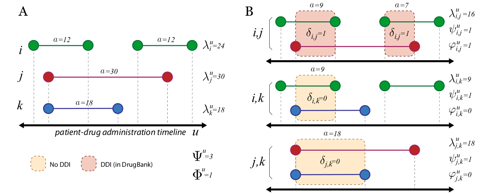
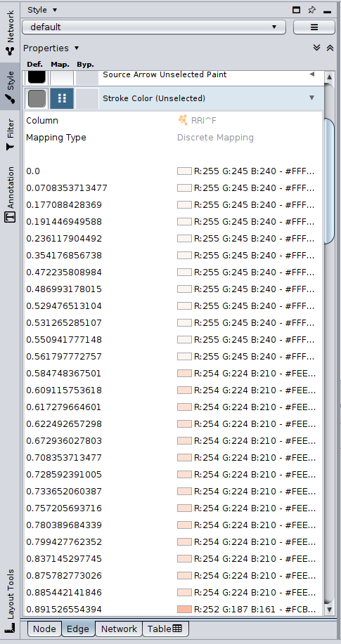
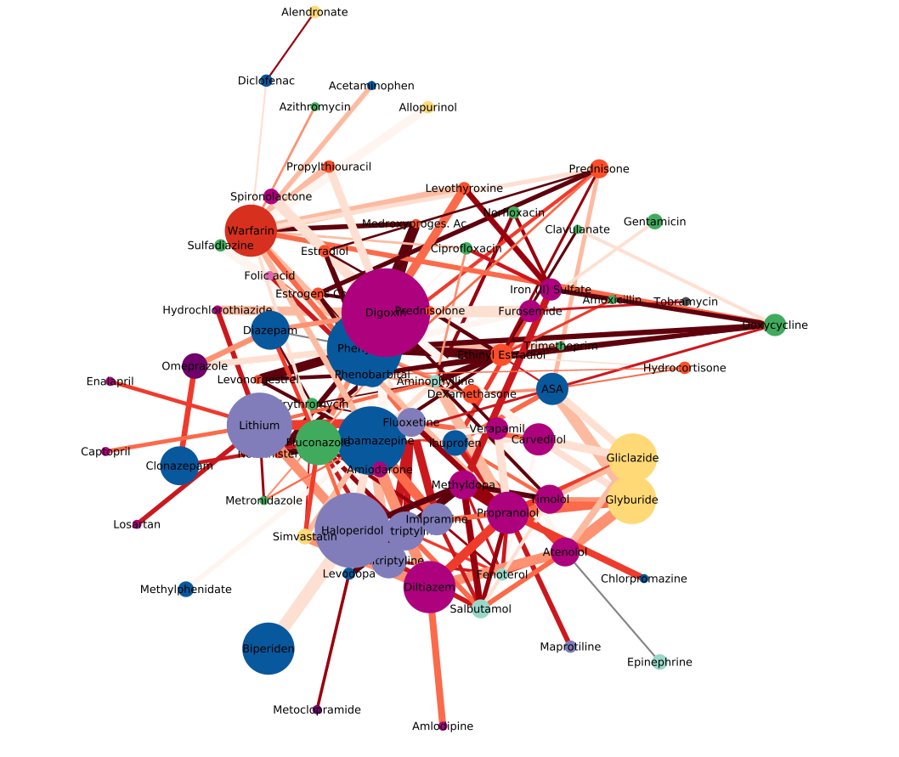
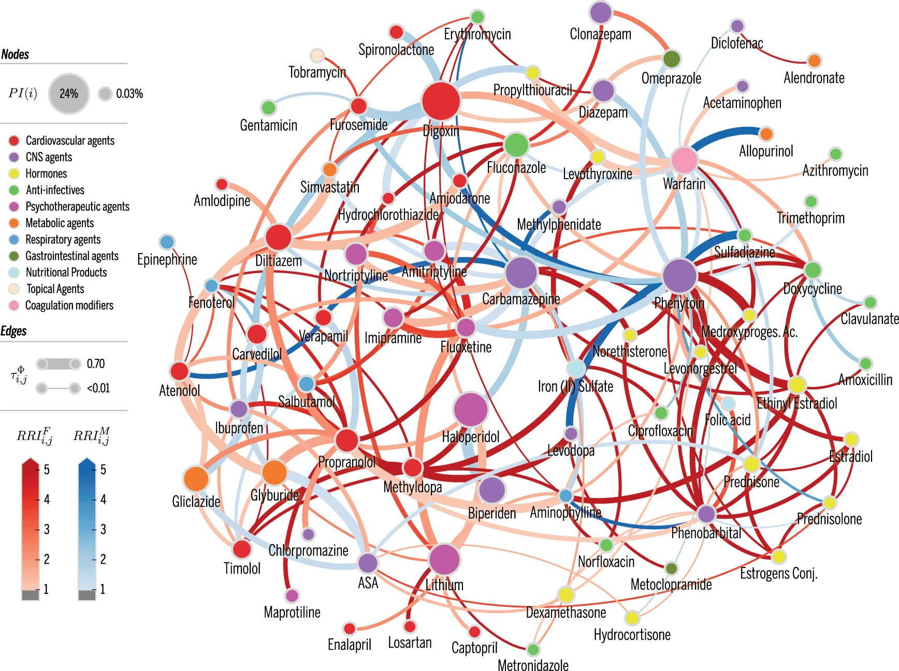

# 1. Apresentação

O presente projeto foi originado no contexto das atividades da disciplina de pós-graduação [*Ciência e Visualização de Dados em Saúde*](https://ds4h.org), oferecida no primeiro semestre de 2022, na Unicamp.

| Nome                          | RA     | Especialização |
| ----------------------------- | ------ | -------------- |
| Bruna Osti                    | 231024 | Computação     |
| Fabio Fogliarini Brolesi      | 023718 | Computação     |
| Ingrid Alves de Paiva Barbosa | 182849 | Computação     |

Tabela 1 - Equipe autora do projeto.

# 2. Referência bibliográfica do artigo lido
Brattig Correia, R., de Araújo Kohler, L., Mattos, M.M. et al. City-wide electronic health records reveal gender and age biases in administration of known drug–drug interactions. npj Digit. Med. 2, 74 (2019). https://doi.org/10.1038/s41746-019-0141-x

# 3. Organização do repositório

O trabalho desenvolvido é divulgado de forma pública em [*repositório do GitHub*](https://github.com/brolesi/ds4h/tree/main/p2) e sua organização foi feita da seguinte forma:

~~~
├── README.md                         <- relatório do projeto (você está aqui!)
│
├── data
│   └── raw                            <- dados originais sem modificações copiados da base fornecida pelos autores.
│
├── src                                <- redes geradas
|   ├── cytoscape_female.cys           <- rede para risco de interação feminino
|   ├── cytoscape_male.cys             <- rede para risco de interação masculino
│
└── assets                             <- mídias usadas no projeto
~~~

# 4. Resumo
O artigo escolhido se chama "_City-wide electronic health records reveal gender and age biases in administration of known drug–drug interactions_" e aborda sobre as reações adversas a medicamentos (ADR, do inglês _Adverse drug reactions_) de interações medicamentosas (DDI, do inglês _drug–drug interactions_), que é um tema muito discutido na medicina ao redor do Mundo. 

A ADR é uma resposta prejudicial ou indesejável, não intencional, do organismo, que ocorre após utilizar um medicamento. Dentre as razões que levam a uma ADR, 30% delas são devidas às interações medicamentosas, e os pacientes com complicações decorrentes da DDI tendem a reentrar no sistema de saúde em um nível mais caro. Além disso, estima-se que 52% das reações em pacientes ambulatoriais eram evitáveis. Se essas reações forem evitadas, haverá uma grande economia no setor de saúde, principalmente no âmbito público, além de reduzir os riscos de problemas de saúde para os pacientes.

Diante desse cenário, o trabalho visou realizar um estudo longitudinal em larga escala do fenômeno DDI nos níveis de atenção primária, nas Unidades Básicas de Saúde (UBS), e secundária, nas Unidades de Pronto Atendimento (UPA 24h), em uma cidade inteira, usando janelas de tempo consideravelmente maiores e contando com padrões públicos de DDI e ADR. Para realiar este estudo, foi feito um estudo de caso referente à população de Blumenau, no estado de Santa Catarina, Sul do Brasil. Blumenau é uma cidade que no ano da realização do trabalho tinha uma população aproximada de 340mil habitantes e um IDH igual a 0,806, considerado um valor muito alto. Em Blumenau, o custo anual com problemas de saúde resultantes de DDI em pessoas acima de 65 anos é US$2 (per capita), podendo chegar á US$7 se aplicadas taxas e inflações. Estes valores mostram que este problema é mais grave do que se pensava anteriormente, e quanto mais velha é a população, maior é esse custo.  

Os autores do trabalho tiveram acesso à todos os prontuários médicos de 18 meses (Jan 2014 – Jun 2015), fornecidos pela prefeitura do município. Após as análises de dados e construção das redes complexas, foram constatados que 181 pares de medicamentos que podem interagir e causar reações foram dispensados, mas 4% dos pacientes receberam pares de medicamentos que provavelmente resultarão em ADR. Ao profundar na análise dos dados, também foi identificado que mulheres tem um risco 60% maior de DDI do que homens, e essa taxa pode aumentar para 90% quando considera-se as interações com graves reações, e curiosamente, foi identificado que isso esta relacionado a causas sociais ou biológicas não conhecidas ainda. As pessoas idosas, com idade entre 70 e 79 anos têm um risco de 34% de DDI. Por fim, eles também forneceram uma rede de medicamentos e fatores demográficos paran categorizar o DDI.

Os autores disponibilizaram um [repositório no GitHub](https://github.com/rionbr/DDIBlumenau) que contém todos os códigos desenvolvidos, além dos arquivos com os dados de entrada para que pudessem ser reproduzidos. Além disso, há um [material complementar](https://static-content.springer.com/esm/art%3A10.1038%2Fs41746-019-0141-x/MediaObjects/41746_2019_141_MOESM1_ESM.pdf) disponibilizado que contém informações, gráficos e resultados extras para auxiliar na reprodução.

# 5. Breve descrição do experimento que foi replicado
O experimento deste trabalho iniciou com a análise e tratamento dos dados. Em seguida, foi desenvolvido o método em si, em que calcula-se o risco relacionado ao gênero e à idade, com a geração da rede de DDI, e com os classificadores de aprendizado de máquina. Uma breve explicação de cada etapa do método usado será apresentado a seguir. 

## 5.1. Tratamento dos dados
A equipe recebeu os prontuários da prefeitura de Blumenau de 18 meses, entre Janeiro de 2014 e Junho de 2015, e analisaram os relatórios de medicamentos e dosagens prescritos no período. Estes dados foram anonimizados na fonte e manteve-se apenas as dosagens com os medicamentos e algumas variáveis demográficas como gênero, idade, bairro, estado civil e escolaridade. O conscentimento para coleta dos dados não é de responsabilidade da equipe, já que não foram eles os responsáveis pela coleta.

Os nomes dos medicamentos foram traduzidos para o inglês, foram eliminados os casos ambíguos, e foram usados identificadores para os medicamentos (baseado no DrugBank ID, que é explicado melhor na seção 5.2). Medicamentos com vários componentes, como por exemplo a Amoxicilina 500 mg e Clavulanato 125 mg, foram divididos por seus componentes. Além disso, foram dispensadas substância que não estão presentes no DrugBank, como por exemplo, o leite em pó e complexos vitamínicos. Após todos os tratamentos, 122 medicamentos únicos foram mantidos para análise.

Dentro do período considerado, foram registradas 1.573.678 administrações de medicamentos à 132.722 pacientes distintos, equivalente à 17% da população da cidade. Destes pacientes, 41,5% são homens e 58,5% são mulheres. Um total de 46% destes pacientes declararam a escolaridade, e destes, 46,77% relatou ter o ensino fundamental incompleto e 20,49% o ensino médio completo ou superior. O percentual de pacientes que receberam pelo menos dois medicamentos é de 78,97%, e é com esse grupo que a equipe trabalhou, afinal, apenas eles poderiam ter alguma DDI.

É importante ressaltar que a equipe afirmou que não existiam meios para saber se os pacientes realmente tomaram os medicamentos prescritos, então a análise pressupõe que todos os medicamentos prescritos foram administrados.

## 5.2. Método do artigo
Para realizar o trabalho os autores se basearam na versão de 2011 do DrugBank, uma base de dados aberta de medicamentos, que possuí informações de DDI. Essa base possuí identificadores para cada medicamento, chamados de DBID. Foram criadas variáveis para analizar a prescrição de mais de um medicamento simultaneamente, conforme a Figura 1, onde $a$ é o numero de dias por intervalo de uso do medicamento, λ é o total de dias do uso do medicamento somando todos os intervalos. Quando mais de um medicamento foi utilizado simultâneamente, eles são analisados em pares, e a quantidade de pares é representada pela variavel ψ. Se aquela interação está presente no DrugBank é marcado em vermelho (e recebe valor  φ = 1), caso contrário é marcado em laranja (e recebe valor φ = 0).

Figura 2 - Configuração das cores dos nós.

Para cada par de DDI observado, existe uma gravidade definida pela base [Drugs.com](drugs.com), sendo classificada em maior, moderada, menor ou n/a. Essas gravidades foram numericamente normalizadas, e baseado nisso foram gerados os pesos das arestas. Os pesos das arestas representam a probilidade de um medicamento ser prescrito simultaneamente com outro medicamento, e seu risco de gerar comorbidades por terem sido co-administrados. O peso pode ser calculado conforme a equação 1.

$$\tau_{i,j}^{\mathrm{\Psi }} = \frac{{\mathop {\sum}\limits_{u \in U_{i,j}^{\mathrm{\Psi }}} {\tau_{i,j}^{u}} }}{{|U_{i,j}^{\mathrm{\Psi }}|}}$$

Equação 1 - Equação do peso.

A partir desta definição acima, foram criadas duas equações para representar o risco de interação em mulheres e em homens, sendo que um é o inverso do outro. A equação 2 apresenta o risco de interação para mulheres.

$$ RRI ^ {\mathrm{F}} = \frac{{P({\mathrm{\Phi }} ^ u > 0|u \in U^{\mathrm{F}})}}{{P({\mathrm{\Phi }}^u > 0{\mathrm{|}}u \in U^{\mathrm{M}})}} = \frac{{|U^{{\mathrm{\Phi }},{\mathrm{F}}}|/|U^{\mathrm{F}}|}}{{|U^{{\mathrm{ \Phi }},{\mathrm{M}}}| / |U^{\mathrm{M}}|}} $$

Equação 2 - Equação do risco de interação para mulheres.

Na geração da rede, os nós representam os medicamentos e as arestas representam as interações entre cada medicamento entre si, sendo que os pesos das arestas são definidos pela equação 1 já apresentada. Já o tamanho dos nós representam a probabilidade de interação daquele medicamento com outros, e é definido pela equação 3 abaixo, sendo que os nós maiores são considerados os mais perigosos de serem co-administrados.

$$ PI(i) = \frac{\sum_{j}\Phi_{i,j}}{\sum_{j}\Psi_{i,j}} $$

Equação 3 - Equação da probabilidade de interação por medicamento.

Por fim, as cores das arestas se baseam nos riscos de interação para homens e mulheres. A cor azul representa os riscos em homens e a cor vermelha representa os riscos em mulheres, e quanto mais escura a cor, maior o risco (consequentemente, quando mais clara, menor o risco). 

Para melhor compreensão da idade neste cenário, os pacientes foram divididos em grupos por idade, e o risco de cada grupo foi calculado, seguindo o mesmo conceito do cálculo por gênero, conforme apresentado na equação 4.

$$ RI^{[y_1,y_2]} = \frac{{P({\mathrm{\Phi }}^u > 0|u \in U^{[y_1,y_2]})}}{{P({\mathrm{\Psi }}^u > 0|u \in U^{[y_1,y_2]})}}$$

Equação 4 - Equação do risco de interação por faixa etária.

Foi definido pelos autores um modelo nulo para treinar um sistema que seja capaz de identificar o aumento esperado do risco de determinada interação considerando o gênero e a faixa etária. Para isso, foram utilizadas ferramentas de aprendizado de máquina, com os classificadores lineares _Support Vector Machine_ (SVM) e Regressão Logística, fazendo a validação cruzada estratificada 4 vezes, para garantir um bom desempenho. As variáveis demográficas usadas foram a Idade (faixa etária), gênero, número de medicamentos, e número de co-administrações. Já como característica binária usou-se uma variável definida como 1 caso o paciente tenha recebido determinado medicamento, e como 0 caso contrário. Isso permite que os classificadores sejam treinados para definir a probabilidade de uma determinada combinação de medicamentos. 

Os classificadores são comparados a três modelos nulos:

* Modelo nulo do tipo "lançamento de moedas" imparcial, em que cada classe tem a mesma probabilidade
* Modelo nulo do tipo "lançamento de moedas" tendencioso, com base na frequência de cada classe
* Modelo nulo que encontra a melhor idade de corte para cada gênero, sendo que acima do crote, todos são considerado afetados pela DDI. 

Para avaliar o desempelho dos classficadores, os autores consideraram o coeficiente de correlação de Matthew (MCC), a área sober a curva ROC (AUC ROC), e a área sob a curva de precisão e recuperação (AUC P/R).

## 5.3. Dados fornecidos

Foram fornecidos 41 códigos em python, 2 códigos em R e 16 arquivos do tipo ".csv", em [repositório online](https://github.com/rionbr/DDIBlumenau). A tabela 2 apresenta todos os arquivos ".csv" fornecidos.

Dataset | Resumo descritivo
----- | -----
age.csv | Número de pacientes por faixa etária
age_female.csv | Número de pacientes por faixa etária estratificado por mulheres
age_male.csv | Número de pacientes por faixa etária estratificado por homwna
ddi.csv | Matriz de interação entre drogas
drug.csv | Lista de medicamentos com seus respectivos códigos e parâmetros
gender.csv | Número de pacientes por gênero
ml_features_simple.csv | Coeficientes de cada modelo para cada medicamento
ml_results_complete.csv | Métricas completas para cada modelo
ml_results_nodrug.csv | Métricas para cada modelo sem os medicamentos
ml_results_simple.csv | Métricas simples para cada modelo
net_edges.csv | Características das arestas na rede construída
net_nodes.csv | Características dos nós na rede construída
net_pca_tau-s.csv | Valores de peso por xxx
net_pca_tau.csv | Valores de peso por yyy
net_pca_u-s.csv | Valores de pca por xxx
net_pca_u.csv | Valores de pca por yyy

Tabela 2 - Arquivo utilizado para a reprodução do grafo complexo.

# 6. Método
O primeiro passo deste trabalho foi a leitura completa do artigo para melhor compreensão do que foi realizado. Nesse primeiro momento também foi feita a exploração dos arquivos fornecidos pelos autores em repositório online, e a análise do material complementar. A partir disso, dividiu-se o trabalho em trẽs grandes frentes: (i) análise exploratória dos dados, (ii) construção da rede complexa, (iii) aprendizado de máquina. Para reprodução do trabalho não haveria tempo hábil para realizar as três frentes, e já que os outros projetos realizados na disciplina já focaram em analise exploratória (P1) e aprendizado de máquina (P2), optamos por fazer apenas a frente de redes complexas.

A partir desta definição, foi executado o código [build_ddi_network.py](https://github.com/rionbr/DDIBlumenau/blob/master/build_ddi_network.py) fornecido pelos autores do artigo, que é responsável por construir a rede complexa e gerar gráficos para visualizá-la. Porém pela ferramenta _Cytoscape_ seria possível obter mais detalhes e uma visualização mais interessante da rede. Sendo assim, foram implementadas duas redes usando a ferramenta _Cytoscape_, uma para o sexo feminino e outra para o sexo masculino.

A entrada para a construção da rede foi o arquivo [ddi.csv](https://github.com/brolesi/ds4h/blob/main/p3/data/raw/ddi.csv). A origem é a coluna _class i_, que representa o primeiro medicamento, e o alvo é a coluna _class j_, que repreenta o medicamento que interaje com o primeiro. O peso é definido pela coluna _tau_.

As cores dos nós foram baseadas nas 11 categorias de medicamentos apresentadas pelo autor. Para essa implementação foi criada a coluna _class_ (em nodes) de forma manual, a partir dos valores da coluna _class i_ e _class j_ do arquivo original "ddi.csv". Assim, cada medicamento teve a definição de sua respectiva categoria. Em seguida, foi usada a configuração **_Style >> fill color (na aba nodes)_**, para buscar as categorias na coluna _class_ e associá-las às suas cores, conforme Figura 2 abaixo. 

Figura 2 - Configuração das cores dos nós.

Já o tamanho dos nós está relacionado com a probabilidade da interação, representado na coluna PI(i). Esta replicação de configuração foi feita em **_Style >> Size (aba Node) >> seleção da coluna PI(i)_**, conforme apresentado na Figura 3.

Figura 3 - Configuração dos tamanhos dos nós.

A largura da aresta foi feita com base no peso, sendo que quanto maior o peso, mais grossa é a aresta. Isso foi configurado em **_Style >> Width (na aba edge) >> Seleção coluna tau_**, conforme Figura 4.

Figura 4 - Configuração das larguras das arestas.

A intensidade da cor da aresta é baseada no risco de interação, sendo azul para homem e vermelho para mulher. Aqui foi necessário dividir a rede em dois arquivos, um para cada gênero, pois não seria possível colocar os riscos de interação masculino e feminono na mesma rede. Para cada uma das duas redes, o processo das configurações anteriores foi o mesmo, tendo uma diferença apenas para essa configuração.  

Na rede com o risco de interação masculino, a configuração foi feita em **_Style >> Stroke color (na aba edge) >> Seleção da coluna RRI^M >> Seleção do tipo "Continuous mapping" >> Seleção das cores em gradiente azul_** conforme apresentado na Figura 5. Já para a rede com o risco de interação feminino, a configuração contínua não estava disponível, por isso foi necessário usar o tipo discreto em **_Style >> Stroke color (na aba edge) >> Seleção da coluna RRI^F >> Seleção do tipo "Discrete mapping" >> Seleção das cores de forma manual em tons de vermelho_** conforme Figura 6.

Figura 5 - Configuração das cores das arestas para a rede de RRI(M).

Figura 6 - Configuração das cores das arestas para a rede de RRI(F).

# 7. Resultados
Com as configurações realizadas, tem-se como resultado as duas redes apresentadas na Figura 7, para risco de interação masculino, e Figura 8, para risco de interação feminino.

Figura 7 - Rede para risco de interação masculino.

Figura 8 - Rede para risco de interação feminino.

A rede elaborada pelos autores do artigo é apresentada na Figura 9. No trabalho original a implementação foi feita em apenas uma rede, já em nossa reprodução dividiu-se em duas redes por limitações no uso da ferramenta _Cytoscape_. Apesar disso, todas as outras configurações da rede reproduziram exatamente o que foi realizado pelos autores.

Figura 9 - Rede do trabalho original.

Nas três figuras de rede é possível identificar a presença de 75 nós e 181 arestas, sendo que para mulheres, há maior predominância de cores intensas (escuras), que representam um risco de interação maior. Com isso, pode-se afirmar que as mulheres estão sujeitas a DDIs mais graves, quando comparadas aos homens. 

Os principais medicamentos, que participam de mais de 10 DDI distintos são: Fenitoína, Carbamazepina, Fenobarbital, Propranolol, Varfarina, Aminofilina, Fluoxetina r Fluconazol. O tamanho dos nós representa a probabilidade de interação, e o maior valor é para o medicamento Digoxina (PI(I) = 0.24), que é pertencente à categoria de agentes cardiovasculares, seguido pela Fenitoína (PI(I) = 0.2), um medicamento anticonvulsivo. Além disso a Fenitoína é o medicamento que mais tem interações (24 interações) e também a maior centralidade (0.3). 

Por fim, A largura da aresta representa o peso, e o maior peso é 0.69537773, para a interação entre Haloperidol, da classe de agentes psicoterapêuticos, e Biperideno, da classe de agentes do Sistema Nervoso Central. Esta interação está associada ao fato de que Anticolinérgicos incluem risco de psicose e discinesia tardia.

# 8. Conclusão
O artigo escolhido visou analisar as reações causadas em pacientes por interações medicamentosas. Para isso, teve-se acesso aos prontuários médicos dos pacientes da cidade de Blumenau, no Sul do Brasil, do período de Janeiro de 2014 a Junho de 2015. O trabalho realizou uma análise exploratória dos dados, seguida da construção da rede, e por fim de um aprendizado de máquina. Foram fornecidos todos os códigos implementados, os arquivos ".csv" usados como entradas (já anonimizados), e um material complementar com explicações detalhadas dos processos realizados.

Nesta reprodução o foco foi na construção da rede. Para isso, usou-se o arquivo ddi.csv e a ferramenta _Cytoscape_. A representação em rede permitiu integrar, resumir e visualizar o fenômeno DDI. Todas as implementações foram realizadas e as redes puderam ser comparadas. Apesar de algumas limitações enfrentadas, foi possível reproduzir a construção da rede com êxito, e grande parte disso deve-se ao nível de detalhes fornecidos pelos autores. Houve a preocupação de fornecer todos os materiais, códigos e arquivos necessários para uma completa compreensão e reprodução do trabalho.

Conclui-se reforçando a importância da divulgação não só dos resultados finais, mas de todos os processos adotados em trabalhos científicos, para que toda comunidade seja capaz de reproduzí-lo, aprendendo com os acertos, erros e desafios enfrentados ao longo do desenvolvimento.
